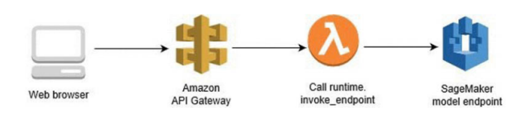

# Recommendation System

## Executive Summary
- What type of machine learning models provide the most accurate recommendations?
- These recommendations are intended to help increase sales and improve customer satisfaction with the application.
- Trained, tested, and evaluated multiple machine learning models using hard-coded baselines, simple means, content-based filtering, collaborative filtering, various custom similarity functions, and hybrid approaches.
- The results showed a hybrid model using both content-based and collaborative filtering achieved an accuracy of 60-90%.

## Project Technologies
- Developed using Python, Jupyter Notebooks, Git, and GitHub.
- Used the following modules and packages: dotenv, gzip, IPython, json, logging, matplotlib, numpy, os, pandas, random, scipy, seaborn, sklearn, and unittest.

## Problem Statement
Educational project to gather data on grocery purchases to recommend additional products to consumers using the data science method of: 
- Problem Identification
- Data Wrangling
- Exploratory Data Analysis
- Pre-processing and Training
- Modeling
- Documentation

Recommender systems are artificial intelligence algorithms, including machine learning models, that use big date to suggest additional products to consumers. They have been shown to improve customer retention, increase sales, and help form habits. For example, Amazon has credited recommendation systems with helping to generate 35% of revenue. In 2016, their yearly sales volume was $135.99 billion.

### Data Wrangling
Two different Amazon datasets from 2018 were used for the project: Grocery and Gourmet Food 5-core and Grocery and Gourmet Food Meta. Merged them using an inner join creating 29 columns with 1.1 million+ rows. 

Removed 6 columns that had less than 5% of the data and didn't look critical for this task. Next, dropped another 8 columns that would have required additional analysis outside the scope of this project to be useful. Finally, removed duplicate asin rows that were very similar for both the product and review info. The data for the rest of the project included 15 columns with about 149k to 1.1 million rows.

The features of interest related to implicit feedback are title, also_buy, also_view and rank. While the features related to explicit feedback are overall and summary. The target feature is ‘overall’; which is the overall rating of the product.

| Column     | Non-Null Count    | Data Type |
| ------     | ----------------  | --------- |
| category   |  1083170 non-null | object    |
| title      |  1083170 non-null | object    |
| also_buy   |  926546 non-null  | object    |
| brand      |  1075197 non-null | object    |
| rank       |  1039163 non-null | object    |
| also_view  |  577060 non-null  | object    |
| main_cat   |  1081896 non-null | object    |
| price      |  750231 non-null  | float64   |
| asin       |  1083170 non-null | object    |
| overall    |  1083170 non-null | float64   |
| verified   |  1083170 non-null | bool      |
| reviewerID |  1083170 non-null | object    |
| vote       |  149247 non-null  | float64   |
| style      |  559212 non-null  | object    |

### Exploratory Data Analysis
There were only 3 numeric (overall, price, and vote) and 1 boolean (verified) features in the data set. All of these features were skewed towards a particular value; however, none were correlated with each other. Ended up dropping the summary feature because it contained a lot of duplicate data with the target feature of overall rating.

The majority of the features were categories/objects/text. There are so many categories it wasn't possible to do one hot encoding because of memory issues. However, this doesn’t matter because the project will use processes designed specifically for recommendation systems to overcome these limitations.

#### Categories and Objects
| Features | Number of Categories |
| --- | --- |
| category | 1107 |
| title | 40969  |
| also_buy | 29115 |
| brand | 8861 |
| rank | 36865 |
| also_view | 21871 |
| main_cat | 17 |
| asin | 41280 |
| reviewerID | 127496 |
| summary | 526687 |
| style | 27490 | 

### Preprocessing and Training
Using a subset of the data going forward for processing speed reasons. Would still limit the amount of data first in most scenarios to get feedback from several models faster. Performed an 80/20 train/test split on this smaller dataset.

Using the Root Mean Square Error (RMSE) to determine how well the model performed; i.e. how close the prediction was to the actual rating. RMSE is often used because:
- measures the average magnitude of the error.
- very easy to differentiate.
- gives a relatively high weight to large errors.

### Modeling
Created multiple versions of the recommendation model for predictions:
- v0 used hard coded values for baseline comparisons,
- v1 used the mean,
- v2 used several custom similarity functions, and 
- v3 was a hybrid using both content-based and collaborative systems.

#### Version 0
In a real world project, this most likely would be calculated using the company's previously related data and business use cases. In this case, the baseline model was found by hard coding a rating of 4 for all recommendations. This resulted in a RMSE of 1.1813. A lower score is better; with 0 being perfect. Ideally, want to have all future models improve from here.

#### Version 1 
The collaborative mean is the simple average of users. The content mean is the simple average of the products. Using either was not a good predictor. The collaborative mean was better (had a lower error) than the content mean. However, the best RMSE of 1.5540; which is much worse than the baseline model.

#### Version 2 
Calculated with several custom similarity functions; such as pearson, euclidean, cosine, and jaccard. The best performing was euclidean with a RMSE of 1.2234. In all cases, they were: 
- very close to one another with no function being clearly better than another.
- better than the v1 predictions.
- worse than the best baseline prediction.

#### Version 3 
Employed a hybrid approach of combining both the content-based and collaborative filtering. In all cases, the estimates on the training data were significantly better than all previous notebook versions. The best performing was euclidean with a RMSE of 0.2027. However, the estimates on the testing data were not as good at 1.1413. Despite this, these predictions were still better than all previous versions; including the baseline.

#### Version 3.1
Several popular recommendation systems return only 10 to 20 results. Therefore, creating a function to return the top x recommendations worked even better. Also, added other performance evaluation metrics to evaluate the results. These included: precision, recall, f1-score, and a precision-recall curve. 

The results were significantly better when choosing a random sample of 10 and only including recommendations that were predicted to be 5-stars. During analysis and testing these predictions were 60 to 90% accurate.

### Additions to Project
- Created logging, unit, and integration tests.
- Added .env (not in source control) and environment_example.txt files.
- Refactored course example tutorial from Python 2 to Python 3; which involved updating a lot of deprecated code and re-writing functions and classes.

## Conclusion
Recommendation systems improve customer retention, increase sales, and help form customer habits. 
This project involved gathering, cleaning, exploring, analyzing, pre-processing, modeling, and presenting conclusions related to multiple data sets. 
The modeling part included training, testing, and evaluating multiple versions using simple means, content-based filtering, collaborative filtering, various custom similarity functions, and hybrid approaches.

The results showed a hybrid model using both content-based and collaborative filtering achieved an accuracy of 60-90%.
The best weighted averages were:
- Accuracy: 90%
- Precision: 81%
- Recall: 90%
- F1-score: 85%

### Biggest Challenges:
- Limiting the scope by:
    - analyzing just grocery data, and 
    - evaluating only the recommendation models listed above.
- More data cleaning was needed than was originally expected. 
    - Most of the data was not null; however, a lot of it was blank or mis-formatted and this had to be significantly wrangled before it could be evaluated.
- Updating the sample code to use more recent examples and tools.
- The amount of processing time and resources needed to analyze the models.

Despite these challenges the project was still successfully completed. These types of scenarios happen in the real world projects too and need to be resolved in order to get the job done.

## Next Steps
The best performing model’s results could be improved by training on more of the data. Only about 1% of the available data was used because of time constraints. Then, this model could be deployed into production with a serverless architecture; such as using Amazon API Gateway, Lambda, and SageMaker.

Next, on the company’s website, A/B testing should be done to determine the most helpful recommendations by analyzing Click Through Rate (CTR), Conversion Rate (CR), and Return on Investment (ROI). Finally, the models, and the related recommendations, should continue to be enhanced by adjusting to new data, the user’s behavior, and purchases over time.

## References and Resources
- Jianmo Ni (2018). [Amazon Review Data (2018)](https://nijianmo.github.io/amazon/).
- Muffaddal Qutbuddin (2020). [An Exhaustive List of Methods to Evaluate Recommender Systems](https://towardsdatascience.com/an-exhaustive-list-of-methods-to-evaluate-recommender-systems-a70c05e121de).
- Rumi Olsen (2018). [Call an Amazon SageMaker model endpoint using Amazon API Gateway and AWS Lambda](https://aws.amazon.com/blogs/machine-learning/call-an-amazon-sagemaker-model-endpoint-using-amazon-api-gateway-and-aws-lambda/).
- Scikit Learn 0.24.2 (2021). [Precision-Recall](https://scikit-learn.org/stable/auto_examples/model_selection/plot_precision_recall.html).
- Sigmoidal.io (2017). [AI & Machine Learning Consulting. Recommendation Systems - How Companies are Making Money](https://sigmoidal.io/recommender-systems-recommendation-engine/).
- Tomáš Řehořek (2016). [Evaluating Recommender Systems: Choosing the best one for your business](https://medium.com/recombee-blog/evaluating-recommender-systems-choosing-the-best-one-for-your-business-c688ab781a35).
- Unata (2015). [Hands-on with PyData: How to Build a Minimal Recommendation Engine](https://www.youtube.com/watch?v=F6gWjOc1FUs).  
