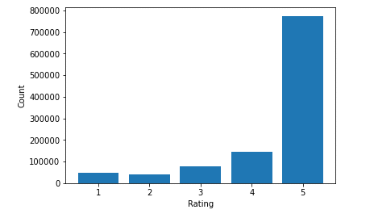

# Recommendation System

## Executive Summary
- Recommendation systems help increase sales and improve customer satisfaction.
- Trained, tested, and evaluated multiple machine learning models using hard-coded baselines, simple means, content-based filtering, collaborative filtering, various custom similarity functions, and hybrid approaches.
- The results showed a hybrid model using both content-based and collaborative filtering achieved the best results with a F1-score of 85%.

## Project Technologies
- Developed using Python, Jupyter Notebooks, Git, and GitHub.
- Used the following modules and packages: dotenv, gzip, IPython, json, logging, matplotlib, numpy, os, pandas, random, scipy, seaborn, sklearn, and unittest.

## Problem Statement
Recommender systems are artificial intelligence algorithms, including machine learning models, that use big date to suggest additional products to consumers. 
They have been shown to improve customer retention, increase sales, and help form habits. 
For example, Amazon has credited recommendation systems with helping to generate 35% of revenue. 
In 2016, their yearly sales volume was $135.99 billion.

This is an educational project to gather data on grocery purchases to recommend additional products to consumers using the data science method of: 
- Problem Identification
- Data Wrangling
- Exploratory Data Analysis
- Pre-processing and Training
- Modeling
- Documentation

### Data Wrangling
Two different Amazon datasets from 2018 were used for the project: Grocery and Gourmet Food 5-core and Grocery and Gourmet Food Meta. 
Merged them using an inner join creating 29 columns with 1.1 million+ rows. 

Removed 6 columns that had less than 5% of the data and didn't look critical for this task. 
Next, dropped another 8 columns that would have required additional analysis outside the scope of this project to be useful. 
Finally, removed duplicate asin rows that were very similar for both the product and review info. 
The data for the rest of the project included 15 columns with about 149k to 1.1 million rows.

The features of interest related to implicit feedback are title, also_buy, also_view and rank. 
The target feature is ‘overall’ which is the rating of the product.

| Column     | Non-Null Count    | Data Type |
| ------     | -------:  | :---: |
| category   |  1,083,170 | object    |
| title      |  1,083,170 | object    |
| also_buy   |  926,546  | object    |
| brand      |  1,075,197 | object    |
| rank       |  1,039,163  | object    |
| also_view  |  577,060   | object    |
| main_cat   |  1,081,896  | object    |
| price      |  750,231   | float64   |
| asin       |  1,083,170 | object    |
| overall    |  1,083,170 | float64   |
| verified   |  1,083,170 | bool      |
| reviewerID |  1,083,170 | object    |
| vote       |  149,247  | float64   |
| style      |  559,212 | object    |

### Exploratory Data Analysis
There were 3 numeric (overall, price, and vote) and 1 boolean (verified) features in the data set. 
All of these features were skewed towards a particular value; however, none were correlated with each other. 
Ended up dropping the summary feature because it contained a lot of duplicate data with the target feature of overall rating.

The majority of the features were categories/objects/text. 
There are so many categories it wasn't possible to do one hot encoding because of memory issues. 
However, this doesn’t matter because the project will use processes designed specifically for recommendation systems to overcome these limitations.

#### Categories and Objects
| Features | Number of Categories |
| --- | ---: |
| category | 1,107 |
| title | 40,969  |
| also_buy | 29,115 |
| brand | 8,861 |
| rank | 36,865 |
| also_view | 21,871 |
| main_cat | 17 |
| asin | 41,280 |
| reviewerID | 127,496 |
| summary | 526,687 |
| style | 27,490 | 

### Preprocessing and Training
Will only use a subset of the data going forward for processing and speed reasons to get feedback faster. 
Performed an 80/20 train/test split on this smaller dataset.

Will use the Root Mean Square Error (RMSE) to determine how well the model performed; i.e. how close the prediction was to the actual rating. 
RMSE is often used because:
- measures the average magnitude of the error.
- very easy to differentiate.
- gives a relatively high weight to large errors.

### Modeling
Created multiple versions of the recommendation model for predictions:
- v0 used hard coded values for baseline comparisons,
- v1 used simple means,
- v2 used several custom similarity functions, and 
- v3 was a hybrid using both content-based and collaborative filtering.

#### Version 0
In a real world project, this would usually use the company's previously collected data and customer information. 
In this case, the baseline model was found by hard coding the same rating for all recommendations. 
A rating of 4 resulted in the best RMSE of 1.1813. A lower score is better; with 0 being perfect. 
Ideally, all future models will improve from here.

#### Version 1 
The collaborative mean is the simple average of users. 
The content mean is the simple average of the products. 
Using either was not a good predictor. 
The collaborative mean was better (had a lower error) than the content mean. 
However, the best RMSE was 1.5540; which is much worse than the baseline model.

#### Version 2 
Used different custom similarity functions (pearson, euclidean, cosine, and jaccard) to calculate the error. 
The best performing was euclidean with a RMSE of 1.2234. In all cases, they were: 
- very close to one another with no function being clearly better than another.
- better than the v1 predictions.
- worse than the best baseline prediction.

#### Version 3 
Employed a hybrid approach of combining both the content-based and collaborative filtering. 
In all cases, the estimates on the training data were significantly better than all previous notebook versions. 
The best performing was euclidean with a RMSE of 0.2027. 
However, the estimates on the testing data were not as good at 1.1413. 
Results show there was an issue with overfitting. 
Despite this, these predictions were still better than all previous versions; including the baseline.

#### Version 3.1
Most recommendation systems return only a subset of the results. 
Therefore, creating a function to return just the top 10 recommendations worked even better. 
During analysis and testing these predictions were 60 to 90% accurate. 
Also, added other performance metrics to evaluate the results. 
These included: precision, recall, f1-score, and a precision-recall curve. 

The results worked well when choosing a random sample of 10 recommendations that were predicted to be 5-stars. 
However, the results were not very good for the other ratings. 
A lesson learned here is that earlier the dataset should have had the 5-star ratings downsampled or the other ratings upsampled to better account for the uneven class distribution.

### Additions to Project
- Created unit and integration tests.
- Provided log results to assist with data cleaning and troubleshooting.
- Added .env (not in source control) and environment_example.txt files.
- Refactored course example tutorial from Python 2 to Python 3; which involved updating a lot of deprecated code and re-writing functions and classes.

### Biggest Challenges
- Limiting the scope by:
    - analyzing just grocery data, and 
    - evaluating only the recommendation models listed above.
- More data cleaning was needed than was originally expected. 
- Updating the sample code to use more recent examples and tools.
- The amount of processing time and resources needed to train and analyze the models.

Despite these challenges and delays the project was still successfully completed. 
These types of scenarios happen in the real world projects too and need to be resolved in order to get the job done.

## Conclusion
Recommendation systems improve customer retention, increase sales, and help form customer habits. 
This project involved gathering, cleaning, exploring, analyzing, pre-processing, modeling, and presenting conclusions related to multiple data sets. 
The modeling section also included training, testing, and evaluating multiple versions using simple means, content-based filtering, collaborative filtering, various custom similarity functions, and hybrid approaches.

The results showed a hybrid model using both content-based and collaborative filtering achieved an accuracy of 60-90%.
The best weighted averages were:
- Accuracy: 90%
- Precision: 81%
- Recall: 90%
- F1-score: 85%

## Next Steps
Create a newer version 4 using PySpark.
This would use parallel processing and cloud computing. 
Then, the best performing model’s results could be improved by training on more of the data. 
Only about 1% of the available data was used because of time constraints. 
Next, this model could be deployed into production.
At this point, it would be possible to get faster prediction times (almost real-time instead of the current batch process).

After that, on the company’s website A/B testing should be done to determine the most helpful recommendations by analyzing Click Through Rate (CTR), Conversion Rate (CR), and Return on Investment (ROI). 
Finally, the models, and the related recommendations, should continue to be enhanced by adjusting to new data, the user’s behavior, and purchases over time.

## References and Resources
- Jianmo Ni (2018). [Amazon Review Data (2018)](https://nijianmo.github.io/amazon/).
- Muffaddal Qutbuddin (2020). [An Exhaustive List of Methods to Evaluate Recommender Systems](https://towardsdatascience.com/an-exhaustive-list-of-methods-to-evaluate-recommender-systems-a70c05e121de).
- Rumi Olsen (2018). [Call an Amazon SageMaker model endpoint using Amazon API Gateway and AWS Lambda](https://aws.amazon.com/blogs/machine-learning/call-an-amazon-sagemaker-model-endpoint-using-amazon-api-gateway-and-aws-lambda/).
- Scikit Learn 0.24.2 (2021). [Precision-Recall](https://scikit-learn.org/stable/auto_examples/model_selection/plot_precision_recall.html).
- Sigmoidal.io (2017). [AI & Machine Learning Consulting. Recommendation Systems - How Companies are Making Money](https://sigmoidal.io/recommender-systems-recommendation-engine/).
- Tomáš Řehořek (2016). [Evaluating Recommender Systems: Choosing the best one for your business](https://medium.com/recombee-blog/evaluating-recommender-systems-choosing-the-best-one-for-your-business-c688ab781a35).
- Unata (2015). [Hands-on with PyData: How to Build a Minimal Recommendation Engine](https://www.youtube.com/watch?v=F6gWjOc1FUs).  
